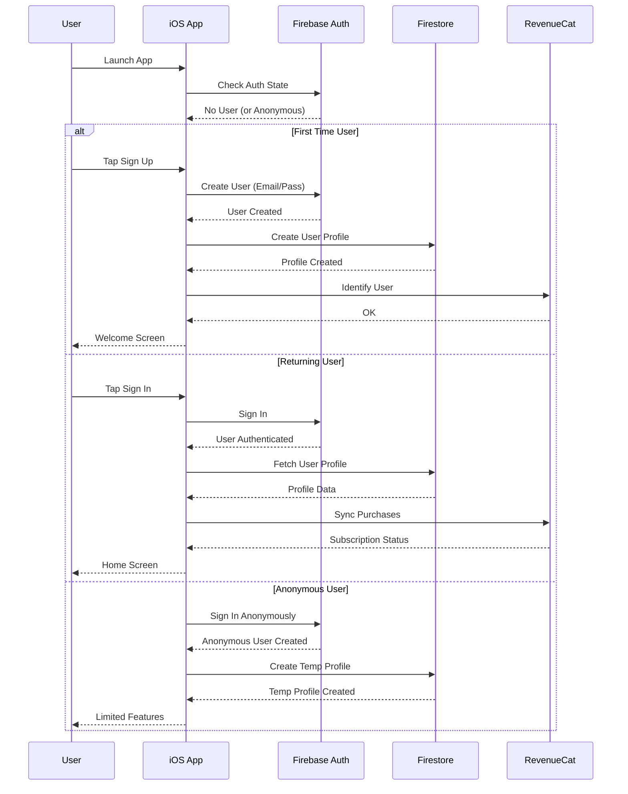
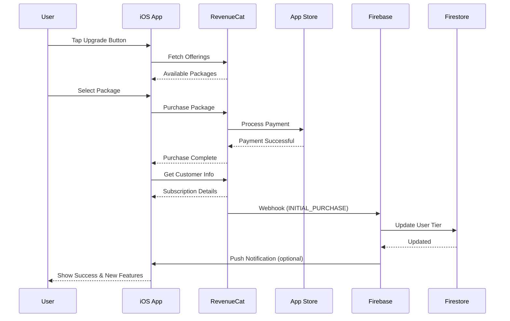
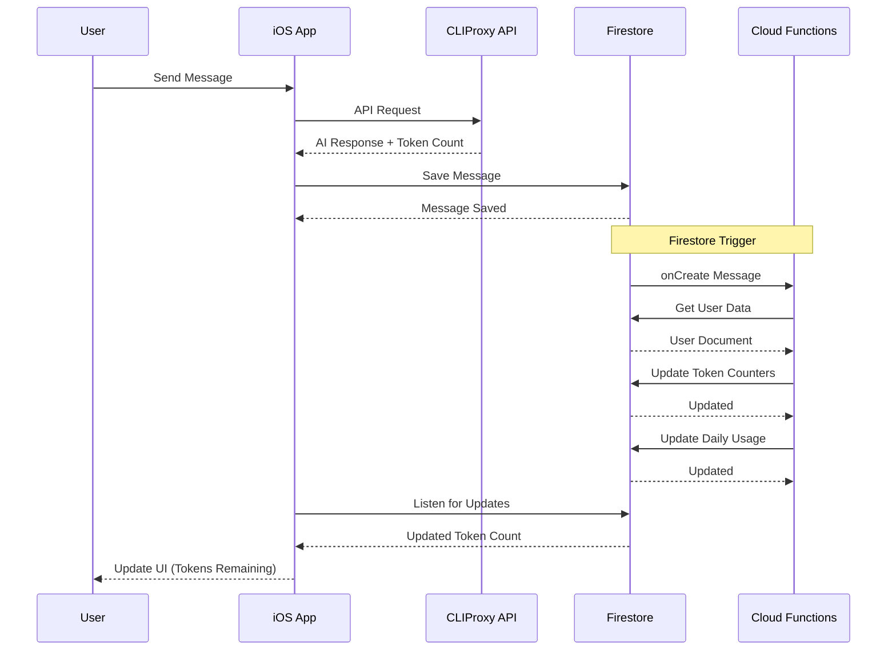

# TTAi Phase 2 Architecture Diagrams

## 1. Complete System Architecture

```
┌─────────────────────────────────────────────────────────────────────────┐
│                          TTAi iOS Application                           │
├─────────────────────────────────────────────────────────────────────────┤
│                                                                         │
│  ┌──────────────┐  ┌──────────────┐  ┌──────────────┐  ┌──────────────┐│
│  │   UI Layer   │  │  Business    │  │   Data       │  │   Service    ││
│  │              │  │   Logic      │  │   Layer      │  │   Layer      ││
│  │• SwiftUI Views│• ViewModels   │• Repositories  │• Network       ││
│  │• Navigation  │• Use Cases     │• Local Storage │• Auth Services ││
│  │• Components  │• State Mgmt    │• Cache         │• Payment      ││
│  └──────┬───────┘  └──────┬───────┘  └──────┬───────┘  └──────┬───────┘│
│         │                  │                  │                  │       │
│         └──────────────────┼──────────────────┼──────────────────┘       │
│                            │                  │                          │
│                            ▼                  ▼                          │
│                    ┌──────────────┐  ┌──────────────┐                    │
│                    │   Core       │  │   External   │                    │
│                    │   Models     │  │   Services   │                    │
│                    │              │  │              │                    │
│                    │• User        │  │• Firebase    │                    │
│                    │• Chat        │  │• RevenueCat  │                    │
│                    │• Message     │  │• CLIProxy    │                    │
│                    │• Subscription│  │• Analytics   │                    │
│                    └──────────────┘  └──────────────┘                    │
└─────────────────────────────────────────────────────────────────────────┘
                                     │
                                     ▼
┌─────────────────────────────────────────────────────────────────────────┐
│                         Backend Infrastructure                          │
├─────────────────────────────────────────────────────────────────────────┤
│                                                                         │
│  ┌──────────────────────────────────────────────────────────────────┐  │
│  │                      Firebase Platform                           │  │
│  │  ┌────────────┐  ┌────────────┐  ┌────────────┐  ┌────────────┐ │  │
│  │  │  Auth      │  │ Firestore  │  │  Cloud     │  │  Storage   │ │  │
│  │  │            │  │            │  │ Functions  │  │            │ │  │
│  │  │• Email/Pass│• NoSQL DB   │• Serverless  │• File Storage│ │  │
│  │  │• Google    │• Real-time  │• Token Track│• User Uploads│ │  │
│  │  │• Apple     │• Queries    │• Webhooks   │• Backups     │ │  │
│  │  │• Anonymous │• Security   │• Cron Jobs  │             │ │  │
│  │  └────────────┘  └────────────┘  └────────────┘  └────────────┘ │  │
│  └──────────────────────────────────────────────────────────────────┘  │
│                                                                         │
│  ┌──────────────────────────────────────────────────────────────────┐  │
│  │                    External Services                             │  │
│  │  ┌────────────┐  ┌────────────┐  ┌────────────┐  ┌────────────┐ │  │
│  │  │ RevenueCat │  │ App Store  │  │  CLIProxy  │  │  Analytics │ │  │
│  │  │            │  │  Connect   │  │            │  │            │ │  │
│  │  │• Payments  │• IAP Products│• AI API Proxy│• Mixpanel    │ │  │
│  │  │• Subscriptions│• Review    │• Model Mgmt │• Firebase    │ │  │
│  │  │• Entitlements│• Metadata  │• Fallback   │ Analytics   │ │  │
│  │  │• Webhooks  │• TestFlight │• Rate Limits│• Crashlytics│ │  │
│  │  └────────────┘  └────────────┘  └────────────┘  └────────────┘ │  │
│  └──────────────────────────────────────────────────────────────────┘  │
└─────────────────────────────────────────────────────────────────────────┘
```

## 2. Authentication Sequence Diagram



## 3. Subscription Purchase Flow



## 4. Token Usage Tracking Flow



## 5. Data Flow Architecture

```
┌─────────────────┐    ┌─────────────────┐    ┌─────────────────┐
│   iOS Device    │    │   Firebase      │    │   External      │
│                 │    │   Backend       │    │   Services      │
├─────────────────┤    ├─────────────────┤    ├─────────────────┤
│                 │    │                 │    │                 │
│  ┌───────────┐  │    │  ┌───────────┐  │    │  ┌───────────┐  │
│  │   Local   │◀─┼────┼──│  Auth     │  │    │  │ RevenueCat│  │
│  │   Cache   │  │    │  │  Service  │──┼────┼──▶  Service  │  │
│  └───────────┘  │    │  └───────────┘  │    │  └───────────┘  │
│        │        │    │        │        │    │        │        │
│  ┌───────────┐  │    │  ┌───────────┐  │    │  ┌───────────┐  │
│  │ ViewModels│◀─┼────┼──│ Firestore │  │    │  │ App Store │  │
│  │   &       │  │    │  │ Database  │──┼────┼──▶  Connect  │  │
│  │  State    │  │    │  └───────────┘  │    │  └───────────┘  │
│  └───────────┘  │    │        │        │    │                 │
│        │        │    │  ┌───────────┐  │    │  ┌───────────┐  │
│  ┌───────────┐  │    │  │  Cloud    │  │    │  │ CLIProxy  │  │
│  │   UI      │◀─┼────┼──│ Functions │──┼────┼──▶   API     │  │
│  │  Layer    │  │    │  └───────────┘  │    │  └───────────┘  │
│  └───────────┘  │    │                 │    │                 │
│                 │    │                 │    │                 │
└─────────────────┘    └─────────────────┘    └─────────────────┘
```

## 6. Security Architecture

```
┌─────────────────────────────────────────────────────────────────┐
│                    Security Layers                              │
├─────────────────────────────────────────────────────────────────┤
│                                                                 │
│  Layer 1: App Transport Security                                │
│  ────────────────────────────────────────────────────────────── │
│  • TLS 1.3 for all network communications                       │
│  • Certificate pinning for critical endpoints                   │
│  • SSL certificate validation                                   │
│                                                                 │
│  Layer 2: Authentication & Authorization                        │
│  ────────────────────────────────────────────────────────────── │
│  • Firebase Auth with multi-factor options                      │
│  • JWT token validation with short expiry                       │
│  • Role-based access control (Free/Premium/Admin)               │
│  • API key encryption in Keychain                               │
│                                                                 │
│  Layer 3: Data Protection                                       │
│  ────────────────────────────────────────────────────────────── │
│  • Firestore security rules with user isolation                 │
│  • Data encryption at rest (Firestore native)                   │
│  • Local data encryption (iOS Data Protection)                  │
│  • Secure enclave for sensitive data                            │
│                                                                 │
│  Layer 4: Payment Security                                      │
│  ────────────────────────────────────────────────────────────── │
│  • RevenueCat handling all payment processing                   │
│  • No sensitive payment data stored locally                     │
│  • Receipt validation with Apple/Google                         │
│  • Fraud detection integration                                  │
│                                                                 │
│  Layer 5: Monitoring & Compliance                               │
│  ────────────────────────────────────────────────────────────── │
│  • Firebase Crashlytics for error tracking                      │
│  • Analytics with privacy controls                              │
│  • GDPR/CCPA compliance tools                                   │
│  • Regular security audits                                      │
│                                                                 │
└─────────────────────────────────────────────────────────────────┘
```

## 7. Scalability Considerations

### 7.1. User Growth Scaling
```
Initial (1K users) → Medium (10K users) → Large (100K+ users)
      │                    │                    │
      ▼                    ▼                    ▼
┌────────────┐     ┌────────────┐     ┌────────────┐
│ Single     │     │ Sharded    │     │ Multi-     │
│ Region     │     │ Database   │     │ Region     │
│            │     │            │     │ Deployment │
│• Firestore │     │• Collection│     │• Global    │
│  rules     │     │  sharding  │     │  load      │
│• Basic     │     │• Index     │     │  balancing │
│  indexes   │     │  optimiz.  │     │• CDN       │
│• Manual    │     │• Auto-     │     │  caching   │
│  backups   │     │  scaling   │     │• Advanced  │
└────────────┘     └────────────┘     └────────────┘
```

### 7.2. Database Scaling Strategy
```
Collection Sharding Example:
users_0, users_1, users_2... (by userID hash)

Write Scaling:
• Batch operations
• Queue-based writes
• Denormalization for read performance

Read Scaling:
• Composite indexes
• Query optimization
• Client-side caching
• Read replicas (if needed)
```

### 7.3. Cost Optimization
```
┌─────────────────┬─────────────────┬─────────────────┐
│   Free Tier     │   Growth Tier   │   Scale Tier    │
├─────────────────┼─────────────────┼─────────────────┤
│ • 10K MAU       │ • 50K MAU       │ • 500K MAU      │
│ • 1GB Storage   │ • 10GB Storage  │ • 100GB Storage │
│ • 50K reads/day │ • 250K reads/day│ • 5M reads/day  │
│ • Blaze plan    │ • Cost alerts   │ • Reserved      │
│   pay-as-you-go │ • Query optim.  │   capacity      │
│ • Monitor usage │ • Cache heavily │ • Bulk discounts│
└─────────────────┴─────────────────┴─────────────────┘
```

## 8. Disaster Recovery Plan

### 8.1. Data Backup Strategy
```
Daily Backups:
┌─────────────────────────────────────────────────────┐
│ Source           │ Method        │ Retention        │
├─────────────────────────────────────────────────────┤
│ Firestore Data   │ Export to GCS │ 30 days rolling  │
│ Cloud Functions  │ Git repository│ Permanent        │
│ iOS App Code     │ Git + CI/CD   │ Permanent        │
│ User Files       │ GCS versioning│ 90 days          │
└─────────────────────────────────────────────────────┘
```

### 8.2. Recovery Procedures
```
1. Database Corruption/Deletion:
   • Restore from latest GCS export
   • Replay transaction logs if available
   • Notify users of potential data loss

2. Service Outage:
   • Failover to backup region
   • Enable maintenance mode
   • Communicate with users via status page

3. Security Breach:
   • Rotate all API keys
   • Force user re-authentication
   • Audit access logs
   • Notify affected users
```

## 9. Monitoring & Alerting

### 9.1. Key Metrics to Monitor
```
┌──────────────────────┬──────────────────┬────────────────────┐
│     Category         │     Metric       │    Threshold       │
├──────────────────────┼──────────────────┼────────────────────┤
│ Authentication       │ Failed logins    │ >100/hour          │
│                      │ Sign-ups         │ Alert on spikes    │
│ Database             │ Read latency     │ >1000ms p95        │
│                      │ Write latency    │ >500ms p95         │
│                      │ Error rate       │ >1%                │
│ Payments             │ Failed purchases │ >5%                │
│                      │ Revenue          │ Daily tracking     │
│ API Usage            │ Token consumption│ >80% of daily limit│
│                      │ Error rate       │ >2%                │
│ User Engagement      │ DAU/MAU ratio    │ <20% alert         │
│                      │ Session duration │ Significant drops  │
└──────────────────────┴──────────────────┴────────────────────┘
```

### 9.2. Alert Channels
```
• PagerDuty/Slack for critical alerts
• Email for daily summaries
• In-app notifications for maintenance
• Status page for public outages
```

This architecture provides a scalable, secure foundation for TTAi Phase 2 with clear growth paths and disaster recovery procedures.
