# TTAi System Topology Map

Generated from inventory: inventory_simple.json
Timestamp: 2026-04-08T01:10:00+07:00

## Interactive View
This diagram shows the current TTAi/OpenClaw system topology with nodes, services, and dependencies.

```mermaid
graph TD

    node-vhp["vannt-home-pc<br/>development<br/>Status: operational"]
    style node-vhp fill:green
    node-vwo["vannt-work-op<br/>compute<br/>Status: operational"]
    style node-vwo fill:green
    node-dell["Dell Zx0Q<br/>production<br/>Status: operational"]
    style node-dell fill:green

    svc-fastapi-8000["FastAPI Original<br/>api<br/>Status: offline"]
    style svc-fastapi-8000 fill:red
    node-vhp --> svc-fastapi-8000
    svc-hybrid-8005["TTAi Hybrid v2.0<br/>api<br/>Status: operational"]
    style svc-hybrid-8005 fill:green
    node-vhp --> svc-hybrid-8005
    svc-debug-8013["TTAi Debug<br/>api<br/>Status: operational"]
    style svc-debug-8013 fill:green
    node-vhp --> svc-debug-8013
    svc-lb-8015["Load Balancer<br/>load_balancer<br/>Status: operational"]
    style svc-lb-8015 fill:green
    node-vhp --> svc-lb-8015
    svc-rag-8075["RAG Service<br/>memory<br/>Status: unknown"]
    style svc-rag-8075 fill:gray
    node-vhp --> svc-rag-8075
    svc-dashboard-8090["Control Dashboard<br/>dashboard<br/>Status: unknown"]
    style svc-dashboard-8090 fill:gray
    node-vhp --> svc-dashboard-8090
    svc-cliproxy-8317["CLI Proxy<br/>cli_proxy<br/>Status: operational"]
    style svc-cliproxy-8317 fill:green
    node-vhp --> svc-cliproxy-8317
    svc-ollama-public["Ollama Public<br/>ai_inference<br/>Status: operational"]
    style svc-ollama-public fill:green
    node-vhp --> svc-ollama-public
    svc-ollama-memory["Ollama Memory<br/>ai_inference<br/>Status: operational"]
    style svc-ollama-memory fill:green
    node-vhp --> svc-ollama-memory
    svc-wordpress["WordPress<br/>cms<br/>Status: offline"]
    style svc-wordpress fill:red
    node-dell --> svc-wordpress
    svc-fastapi-prod["FastAPI Prod<br/>api<br/>Status: offline"]
    style svc-fastapi-prod fill:red
    node-dell --> svc-fastapi-prod
    svc-postgres["PostgreSQL<br/>database<br/>Status: operational"]
    style svc-postgres fill:green
    node-dell --> svc-postgres
    svc-mysql["MySQL<br/>database<br/>Status: operational"]
    style svc-mysql fill:green
    node-dell --> svc-mysql
    svc-redis["Redis<br/>cache<br/>Status: operational"]
    style svc-redis fill:green
    node-dell --> svc-redis
    svc-ollama-remote["Ollama Remote<br/>ai_inference<br/>Status: operational"]
    style svc-ollama-remote fill:green
    node-vwo --> svc-ollama-remote
    svc-fastapi-remote["TTAi Remote API<br/>api<br/>Status: operational"]
    style svc-fastapi-remote fill:green
    node-vwo --> svc-fastapi-remote

    svc-lb-8015 ==>|api_call| svc-debug-8013
    svc-lb-8015 -->|api_call| svc-fastapi-remote
    svc-hybrid-8005 ==>|api_call| svc-cliproxy-8317
    svc-hybrid-8005 ==>|api_call| svc-ollama-public
    svc-rag-8075 ==>|api_call| svc-ollama-memory
    svc-wordpress ==>|database| svc-mysql
    svc-fastapi-prod ==>|database| svc-postgres

    subgraph Legend
        L_operational["Operational"]
        style L_operational fill:green
        L_degraded["Degraded"]
        style L_degraded fill:orange
        L_offline["Offline"]
        style L_offline fill:red
        L_unknown["Unknown"]
        style L_unknown fill:gray
    end
```

## Key
- **Node colors**: Green = operational, Orange = degraded, Red = offline, Gray = unknown
- **Dependency lines**: Regular arrow = normal dependency, Thick arrow = critical dependency

## Current Status Summary
- **Nodes**: 3 total (3 operational)
- **Services**: 16 total (11 operational)
- **Dependencies**: 7 defined

## Notes
This is a static snapshot. For real-time status and interactive exploration, use the Control Dashboard System Topology tab.
